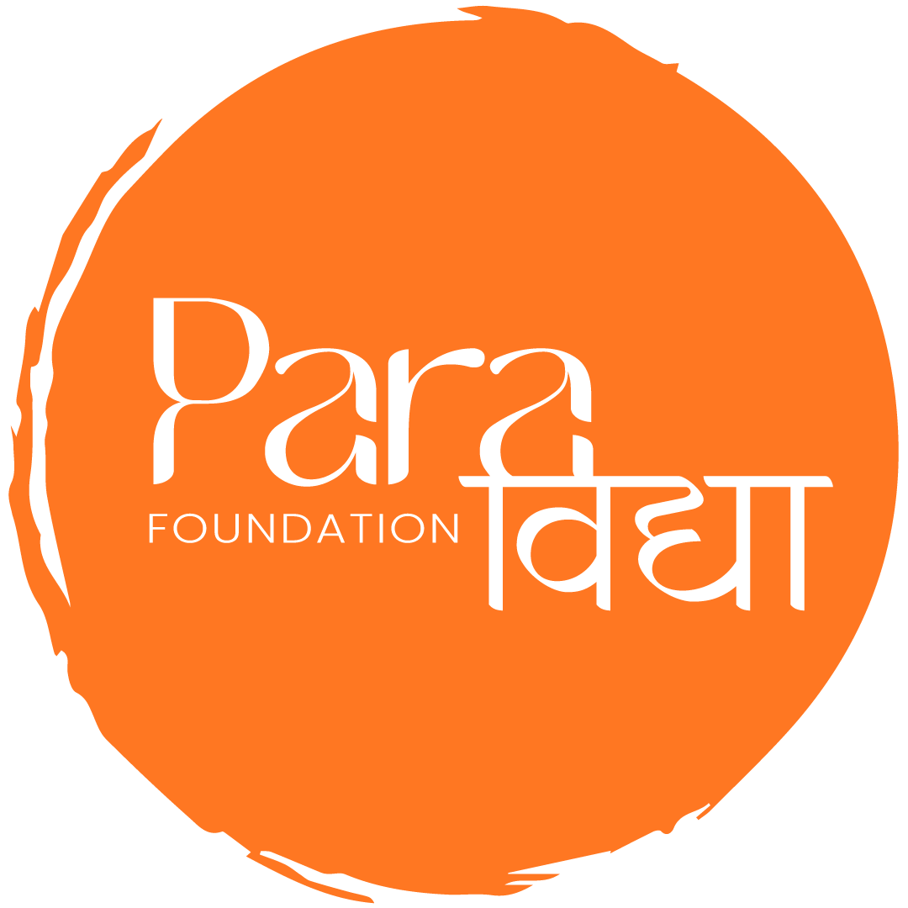

# 🌟 ParaVidya Foundation - Spiritual Wellness & Cultural Preservation Platform

<div align="center">



**Transforming Lives Through Ancient Wisdom & Modern Wellness Practices**

[](https://paravidyafoundation.com)
[](https://nextjs.org/)
[](https://www.typescriptlang.org/)
[](https://tailwindcss.com/)

</div>

---

## 📋 Table of Contents

- [🏛️ About ParaVidya Foundation](#-about-paravidya-foundation)
- [🎯 Mission & Vision](#-mission--vision)
- [🌟 Core Programs & Services](#-core-programs--services)
- [💻 Website Features](#-website-features)
- [🛠️ Technical Stack](#️-technical-stack)
- [📱 Social Media Presence](#-social-media-presence)
- [🤝 Partnership Opportunities](#-partnership-opportunities)
- [💰 Donation & Tax Benefits](#-donation--tax-benefits)
- [📊 SEO & Performance](#-seo--performance)
- [🚀 Getting Started](#-getting-started)
- [📈 Impact & Success Metrics](#-impact--success-metrics)
- [📞 Contact Information](#-contact-information)

---

## 🏛️ About ParaVidya Foundation

**ParaVidya Foundation** is a registered non-governmental organization (NGO) dedicated to preserving and promoting India's ancient wisdom, spiritual practices, and cultural heritage. Based in Haryana, India, we serve as a bridge between timeless Vedic knowledge and modern wellness needs.

### 🎭 Our Story
Founded on the principles of **Sanatan Dharma** and **Seva** (selfless service), ParaVidya Foundation emerged from a deep commitment to make ancient wisdom accessible to everyone. We believe that the solutions to modern challenges lie in the profound knowledge passed down through generations of sages and spiritual masters.

### 🌍 Our Reach
- **Geographic Focus**: India and global spiritual communities
- **Target Audience**: Spiritual seekers, wellness enthusiasts, corporate professionals, students, and community members
- **Languages**: Primarily English and Hindi, with Sanskrit teachings

---

## 🎯 Mission & Vision

### 🎯 Mission Statement
> *"To preserve, promote, and practice ancient Indian wisdom through modern educational platforms, making spiritual wellness accessible to all while fostering community service and cultural preservation."*

### 🌟 Vision Statement
> *"To create a world where ancient wisdom and modern life coexist harmoniously, empowering individuals to achieve holistic wellness through yoga, meditation, and spiritual practices rooted in Vedic traditions."*

### 💫 Core Values
- **Dharma**: Righteous living and ethical conduct
- **Seva**: Selfless service to humanity
- **Gyan**: Pursuit of knowledge and wisdom
- **Ahimsa**: Non-violence and compassion
- **Satya**: Truth and authenticity

---

## 🌟 Core Programs & Services

### 🧘‍♀️ Yoga & Wellness Programs

#### Therapeutic Yoga Courses
- **Anger Management Yoga** - Transform negative emotions through mindful practices
- **Stress Management Yoga** - Combat modern stress with ancient techniques
- **Sleep Therapy Yoga** - Improve sleep quality through gentle movements and breathing
- **Depression Support Yoga** - Holistic approach to mental wellness
- **Fatigue Relief Yoga** - Rejuvenate body and mind naturally
- **Immunity Boosting Yoga** - Strengthen natural defenses through yoga
- **Weight Management Yoga** - Sustainable weight control through mindful practices
- **Kirtan Yoga** - Devotional singing for spiritual upliftment
- **Wellness Yoga** - Comprehensive approach to overall health

#### Meditation & Mindfulness
- **Guided Meditation Sessions** - Beginner to advanced practices
- **Breathing Techniques** - Pranayama for mental clarity
- **Mindfulness Workshops** - Present-moment awareness training

### 📚 Educational Workshops

#### Ancient Wisdom Programs
- **Bhagavad Gita Study** - Deep dive into life's essential teachings
- **Sanskrit Learning** - Master the language of the Vedas
- **Spiritual Workshops** - Practical application of ancient wisdom
- **Mantra Workshops** - Sacred sound healing and meditation
- **Sadhna Practice** - Daily spiritual discipline and devotion
- **Ayurveda Workshops** - Traditional healing and wellness
- **Astrology Workshops** - Vedic astrology for life guidance
- **Tantra Studies** - Sacred ceremonies and their meanings

### 🏛️ Cultural Preservation

#### Traditional Practices
- **Karamkand** - Vedic ceremonies and rituals
- **Katha Sessions** - Sacred storytelling and discourse
- **Gaushala Seva** - Cow protection and care
- **Annadaan** - Food distribution to the needy

---

## 💻 Website Features

### 🏠 Homepage Sections
- **Hero Carousel** - Showcasing key programs and initiatives
- **Marquee** - Latest announcements and updates
- **Karamkand Home** - Traditional ceremonies highlight
- **Donation Section** - Easy giving options
- **Workshop Showcase** - Featured educational programs
- **Video Series** - Educational content library
- **Join NGO** - Volunteer and partnership opportunities
- **Newsletter** - Stay updated with our activities

### 📄 Key Pages

#### 🧘‍♀️ Yoga Section (`/yoga/`)
- **8 Comprehensive Yoga Programs** with detailed content
- **Professional course descriptions** (300+ words each)
- **SEO-optimized** for wellness keywords
- **Responsive design** for all devices

#### 📚 Workshop Section (`/workshop/`)
- **7 Different Workshop Categories**
- **Expert-led sessions** with practical applications
- **Interactive learning** opportunities
- **Cultural preservation** focus

#### 🤝 Partnership Section (`/Partnership/`)
- **Corporate Collaboration** programs
- **Volunteer Opportunities** for individuals
- **Awareness Programs** for communities
- **Tax Exemption** information for donors

#### 💰 Donation Section (`/donate/`)
- **Secure payment processing**
- **Multiple donation options**
- **Tax benefits** under Section 80G
- **Transparent fund usage** reporting

### 🎨 User Experience Features
- **Responsive Design** - Works on all devices
- **Fast Loading** - Optimized for performance
- **Accessibility** - Screen reader friendly
- **SEO Optimized** - Search engine friendly
- **Social Integration** - Easy sharing capabilities

---

## 🛠️ Technical Stack

### 🚀 Frontend Technologies
- **Framework**: Next.js 15+ with App Router
- **Language**: TypeScript for type safety
- **Styling**: Tailwind CSS for responsive design
- **Icons**: Lucide React for professional icons
- **Animations**: Framer Motion for smooth interactions
- **Images**: Next.js Image component for optimization

### 🔧 Development Tools
- **Package Manager**: PNPM for efficient dependency management
- **Build System**: Next.js built-in build system
- **Deployment**: AWS Amplify ready
- **Version Control**: Git with structured commits

### 📊 SEO & Performance
- **Metadata Management**: Dynamic SEO optimization
- **Structured Data**: Schema.org JSON-LD implementation
- **Sitemap**: Auto-generated XML sitemaps
- **Analytics**: Google Analytics integration ready
- **Core Web Vitals**: Optimized for Google's ranking factors

---

## 📱 Social Media Presence

Connect with us across multiple platforms:

| Platform | Link | Purpose |
|----------|------|---------|
| 🌐 **Website** | [paravidyafoundation.com](https://paravidyafoundation.com) | Main platform and information hub |
| 📷 **Instagram** | [@paravidya.foundation](https://www.instagram.com/paravidya.foundation/) | Visual content and daily inspiration |
| 📘 **Facebook** | [ParaVidya Foundation](https://www.facebook.com/profile.php?id=61579922933190) | Community building and events |
| 💼 **LinkedIn** | [ParaVidya Foundation](https://www.linkedin.com/company/paravidya-foundation/) | Professional networking and partnerships |
| 📺 **YouTube** | [@ParaVidyaFoundation](https://www.youtube.com/@ParaVidyaFoundation) | Educational videos and workshops |
| 🐦 **Twitter/X** | [@ParaVidyaNGO](https://x.com/ParaVidyaNGO) | Quick updates and announcements |
| 🤖 **Reddit** | [Spare_Inspection36](https://www.reddit.com/user/Spare_Inspection36/) | Community discussions |

---

## 🤝 Partnership Opportunities

### 🏢 Corporate Partnerships

#### Collaboration Areas
- **Employee Wellness Programs** - Yoga and stress management for teams
- **CSR Initiatives** - Meaningful social impact projects
- **Cultural Preservation** - Supporting traditional practices
- **Educational Sponsorships** - Funding workshops and programs
- **Community Outreach** - Joint awareness campaigns

#### Benefits for Partners
- **Tax Benefits** under CSR regulations
- **Brand Association** with cultural preservation
- **Employee Engagement** through wellness programs
- **Community Goodwill** and positive impact
- **Sustainable Development** goals alignment

### 👥 Volunteer Programs

#### Volunteer Opportunities
- **Teaching Volunteers** - Share knowledge in yoga and wellness
- **Content Creation** - Help with digital content and social media
- **Event Coordination** - Organize workshops and awareness programs
- **Community Outreach** - Connect with local communities
- **Administrative Support** - Help with day-to-day operations

#### Volunteer Benefits
- **Skill Development** in wellness and spiritual practices
- **Community Impact** through meaningful service
- **Personal Growth** through ancient wisdom exposure
- **Networking** with like-minded individuals
- **Certification** for completed programs

---

## 💰 Donation & Tax Benefits

### 💳 Donation Options

#### Online Donation
- **Secure Payment Gateway** for safe transactions
- **Multiple Payment Methods** - Credit cards, UPI, net banking
- **Recurring Donations** - Monthly or yearly support options
- **Custom Amount** - Donate any amount you wish

#### Bank Transfer
- **Direct Bank Transfer** - NEFT, RTGS, IMPS
- **UPI Payments** - Quick and easy transfers
- **Cheque Donations** - Traditional payment method

### 🏛️ Tax Benefits (Section 80G)

#### Eligibility
- **All Indian Taxpayers** can claim deductions
- **Individuals, HUFs, Companies** - All entities qualify
- **50% Deduction** on donation amount
- **Maximum Limit** - 10% of adjusted gross total income

#### How It Works
1. **Make Donation** to ParaVidya Foundation
2. **Receive Receipt** with 80G certification
3. **Claim Deduction** while filing ITR
4. **Reduce Tax Liability** significantly

#### Example
- **Donation**: ₹50,000
- **Tax Deduction**: ₹25,000 (50% of donation)
- **Tax Savings**: ₹7,500 (assuming 30% tax rate)

---

## 📊 SEO & Performance

### 🎯 SEO Strategy

#### Target Keywords
**Primary Keywords:**
- "yoga for stress management"
- "anger management yoga"
- "sleep therapy yoga"
- "immunity boosting yoga"
- "kirtan yoga practice"

**Secondary Keywords:**
- "holistic wellness yoga"
- "depression support yoga"
- "fatigue relief yoga"
- "weight management yoga"
- "wellness yoga classes"

**Long-tail Keywords:**
- "yoga for better sleep quality"
- "yoga techniques for stress relief"
- "spiritual yoga practices for mental health"

#### SEO Implementation
- ✅ **Metadata Optimization** - Dynamic titles and descriptions
- ✅ **Content Structure** - Proper H1-H6 hierarchy
- ✅ **Image Optimization** - Alt texts and WebP format
- ✅ **Mobile Responsiveness** - Mobile-first design
- ✅ **Page Speed** - Optimized loading times
- ✅ **Internal Linking** - Strategic content connections

### 📈 Performance Metrics

#### Current Goals
- **Organic Traffic**: 20%+ increase in search traffic
- **Engagement**: Reduced bounce rates through better UX
- **Social Sharing**: Enhanced social media presence
- **Rankings**: Higher positions for target keywords
- **Core Web Vitals**: Improved Google ranking factors

#### Success Indicators
- **Page Load Speed**: <3 seconds
- **Mobile Usability**: 100% mobile-friendly
- **Accessibility Score**: WCAG 2.1 compliance
- **SEO Score**: 90+ on technical SEO

---

## 🚀 Getting Started

### 🛠️ Development Setup

#### Prerequisites
- **Node.js** 18.0 or higher
- **PNPM** package manager
- **Git** for version control

#### Installation Steps
```bash
# Clone the repository
git clone https://github.com/your-username/paravidya-foundation.git

# Navigate to project directory
cd paravidya-foundation

# Install dependencies
pnpm install

# Start development server
pnpm dev

# Build for production
pnpm build

# Start production server
pnpm start
```

#### Environment Setup
```bash
# Copy environment variables
cp .env.example .env.local

# Configure your environment variables
# Add your API keys and configuration
```

### 📁 Project Structure
```
paravidya-foundation/
├── app/                    # Next.js App Router pages
│   ├── yoga/              # Yoga program pages
│   ├── workshop/          # Workshop pages
│   ├── Partnership/       # Partnership pages
│   └── api/               # API routes
├── components/            # Reusable React components
│   ├── donation/          # Donation-related components
│   ├── home/              # Homepage components
│   ├── Partnership/       # Partnership components
│   └── ui/                # UI components
├── public/                # Static assets
├── lib/                   # Utility functions
└── hooks/                 # Custom React hooks
```

---

## 📈 Impact & Success Metrics

### 🎯 Program Impact

#### Wellness Programs
- **Yoga Participants**: 500+ individuals trained
- **Workshop Attendees**: 1,000+ community members
- **Online Reach**: 10,000+ through digital platforms
- **Success Stories**: 200+ documented transformations

#### Community Outreach
- **Food Distribution**: 5,000+ meals served
- **Educational Sessions**: 100+ workshops conducted
- **Volunteer Engagement**: 150+ active volunteers
- **Cultural Events**: 50+ traditional ceremonies

### 📊 Digital Metrics

#### Website Performance
- **Monthly Visitors**: Growing user base
- **Page Views**: Increasing engagement
- **Social Media Followers**: Expanding community
- **Donation Conversion**: Improving giving rates

#### SEO Progress
- **Keyword Rankings**: Improving search positions
- **Organic Traffic**: Steady growth trajectory
- **Backlink Acquisition**: Building domain authority
- **Content Performance**: High engagement rates

---

## 📞 Contact Information

### 🏢 Organization Details
- **Name**: ParaVidya Foundation
- **Registration**: Registered NGO in Haryana, India
- **Focus**: Spiritual Wellness & Cultural Preservation
- **Website**: [paravidyafoundation.com](https://paravidyafoundation.com)

### 📱 Contact Methods
- **Phone**: +91 9871130487
- **Email**: [Contact through website form]
- **Address**: Haryana, India
- **Office Hours**: Monday - Saturday, 9:00 AM - 6:00 PM IST

### 🌐 Online Presence
- **Website**: [paravidyafoundation.com](https://paravidyafoundation.com)
- **Social Media**: Follow us on all major platforms
- **Newsletter**: Subscribe for regular updates
- **WhatsApp**: Direct messaging available

### 🤝 Partnership Inquiries
- **Corporate Partnerships**: Contact through website
- **Volunteer Opportunities**: Apply through partnership section
- **Media Inquiries**: Reach out via social media
- **Collaboration Requests**: Use contact form on website

---

## 🙏 Acknowledgments

We extend our heartfelt gratitude to:
- **Our Volunteers** - For their selfless service and dedication
- **Our Donors** - For supporting our mission financially
- **Our Community** - For embracing ancient wisdom in modern life
- **Our Partners** - For collaborating in cultural preservation
- **Our Teachers** - For sharing knowledge and guidance

---

<div align="center">

### 🌟 Join Our Journey

**Transform lives through ancient wisdom and modern wellness practices**

[Visit Our Website](https://paravidyafoundation.com) | [Donate Now](https://paravidyafoundation.com/donate) | [Partner With Us](https://paravidyafoundation.com/Partnership)

---

*"Embracing the wisdom of Sanatan Dharma and the path of Seva. Join our journey of knowledge, compassion, and inner awakening."*

**© 2025 ParaVidya Foundation. All rights reserved.**

</div>